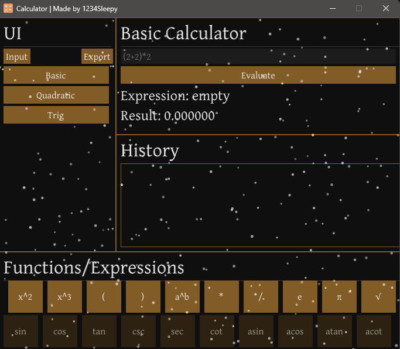

[![Contributors][contributors-shield]][contributors-url]
[![Forks][forks-shield]][forks-url]
[![Stargazers][stars-shield]][stars-url]
[![LinkedIn][linkedin-shield]][linkedin-url]
[![X][X-shield]][X-url]

<!-- PROJECT LOGO -->
 

  

  <h3 align="center">CalaculatorGUI</h3>

<!-- ABOUT THE PROJECT -->
## About The Project

Freshman Fall Term Honor Student project for C++ programming class.

  

(<a href="#readme-top">back to top</a>)

### Built With

ImGUI Library was used as main source for generating GUI.

![C++][C++.]

(<a href="#readme-top">back to top</a>)

## Contact

X - @1234sleepyoff
 
Email - yoltukhivskyia@gmail.com

Project Link: [https://github.com/1234sleepy/CalculatorGUI](https://github.com/1234sleepy/CalculatorGUI)

(<a href="#readme-top">back to top</a>)

## Acknowledgments

 [ImGui Library](https://github.com/ocornut/imgui)
[Main Icons](https://icon-icons.com)

(<a href="#readme-top">back to top</a>)

[C++.]: https://img.shields.io/badge/C++-00599C?style=flat-square&logo=C%2B%2B&logoColor=white
[contributors-shield]: https://img.shields.io/github/contributors/1234sleepy/CalculatorGUI.svg?style=for-the-badge
[contributors-url]: https://github.com/1234sleepy/CalculatorGUI/graphs/contributors
[forks-shield]: https://img.shields.io/github/forks/1234sleepy/CalculatorGUI.svg?style=for-the-badge
[forks-url]: https://github.com/1234sleepy/CalculatorGUI/network/members
[stars-shield]: https://img.shields.io/github/stars/1234sleepy/CalculatorGUI.svg?style=for-the-badge
[stars-url]: https://github.com/1234sleepy/CalculatorGUI/stargazers
[linkedin-shield]: https://img.shields.io/badge/-LinkedIn-black.svg?style=for-the-badge&logo=linkedin&colorB=555
[linkedin-url]: https://www.linkedin.com/in/artur-yoltukhivskyi-1234sleepy/
[x-shield]: https://img.shields.io/badge/X%2FTwitter-black?style=for-the-badge&logo=linkedin&colorB=555
[x-url]: https://x.com/1234sleepyoff
